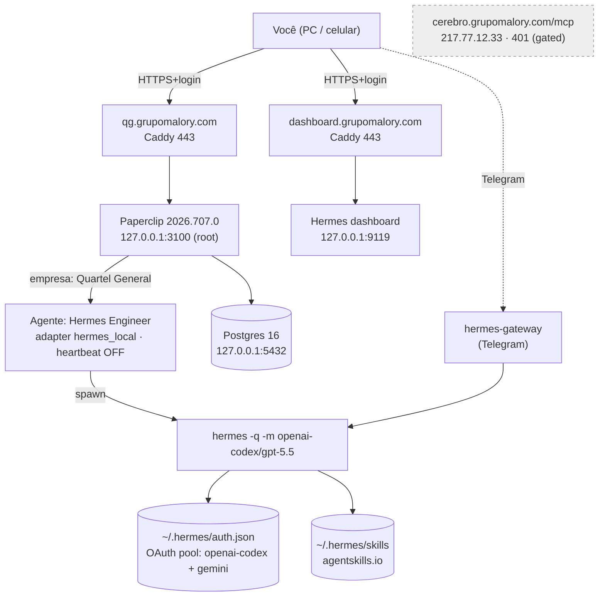
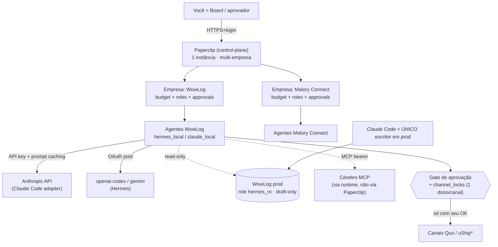

# FASE 1 — Recon + Arquitetura · QG (Paperclip → Hermes → OpenJarvis)

> **Gerado:** 2026-07-17 · **VPS:** `vmi3311151` (89.117.76.183), Ubuntu 24.04.4 LTS
> **Escopo:** recon read-only + doc de arquitetura. **Nada foi instalado, migrado ou escrito em produção.** Implementação = Fase 2, sob o seu "vai".
> **Runbook de origem:** [`/root/QG-paperclip-runbook.md`](QG-paperclip-runbook.md)

Cada conclusão vem marcada com confiança: **[Alta]** = verificado direto na VPS ou em doc oficial · **[Média]** = fonte secundária/parcial · **[Baixa]** = inferência, precisa de confirmação.

---

## 0. TL;DR / Sumário executivo

1. **Eu já estou DENTRO da VPS** (`vmi3311151`, root) — não precisei de SSH. Todo o QG mora em `/root`. O recon foi **local**. **[Alta]**
2. **A base está viva e saudável e é single-tenant hoje:** Paperclip `2026.707.0` (modo `authenticated`, loopback:3100, atrás do Caddy em `qg.grupomalory.com`) + Hermes `v0.18.2` (dashboard em `dashboard.grupomalory.com` + gateway Telegram). **Uma** empresa ("Quartel General") com **um** agente ("Hermes Engineer"). A visão multi-empresa (WowLog + Malory Connect) **ainda não foi construída** — é greenfield sobre base provada. **[Alta]**
3. **Multi-empresa numa instância só é nativo do Paperclip** ("One deployment, many companies. Complete data isolation."). **Confirmado: NÃO instalar segunda instância.** **[Alta]**
4. **Sem Docker, sem Coolify** — bare-metal (systemd + npm + Postgres de sistema + Caddy). MCP Coolify não se aplica. **[Alta]**
5. **Acesso remoto já resolvido:** `qg.grupomalory.com` (Paperclip, login+HTTPS) e `dashboard.grupomalory.com` (Hermes, login+HTTPS) abrem do PC e do celular. **[Alta]**
6. **Auth do modelo — veredito:** o adapter **Claude Code existe** (`claude_local`). Rodar Claude Code 24/7 headless **logado na conta Max é contra a política da Anthropic** e é estrangulado por limites semanais. **Recomendação: API key + prompt caching.** Hermes 24/7 em OAuth de assinatura (`openai-codex`) tem risco documentado de rate-limit (429). **[Alta]**
7. **Cérebro:** **não há clone na VPS** e o MCP `cerebro.grupomalory.com/mcp` mora em **outro host** (217.77.12.33) e responde **401** (exige auth). `git` existe, **`gh` não**. **[Alta]**
8. **OpenJarvis:** **adotar depois** como assistente pessoal LOCAL no seu Windows/WSL2 (skills interoperam com Hermes via agentskills.io). **NÃO adotar** como orquestrador — esse papel fica com o Paperclip. **[Média-Alta]**

---

## 1. Estado real encontrado (inventário)

### 1.1 Host / infraestrutura **[Alta]**

| Item | Valor |
|---|---|
| Hostname / IP | `vmi3311151` / `89.117.76.183` (IPv4 pública confirmada por egress) |
| SO | Ubuntu 24.04.4 LTS (Noble), kernel 6.8 |
| CPU / RAM | 6 vCPU · 11 GiB RAM (1.8 usada, ~9.9 livre) |
| Disco | 193 GB total, 13 GB usado (**7%**), 181 GB livre |
| Swap | **Nenhuma** (ok por ora, RAM sobrando) · uptime 58 dias |
| Runtime | Node v22.23.1 · npm 10.9.8 · Python 3 |
| Orquestração de container | **Nenhuma** — `docker` ausente, sem `/data/coolify`. Tudo bare-metal via **systemd**. |

### 1.2 Paperclip (camada-empresa / control-plane) **[Alta]**

| Item | Valor |
|---|---|
| Pacote / versão | `paperclipai` **2026.707.0** (npm global, pinado) |
| Serviço | systemd `paperclip.service` → `paperclipai run --data-dir /root/.paperclip`, **User=root**, ativo desde 2026-07-15 |
| Bind / porta | **loopback** `127.0.0.1:3100` (só via Caddy) |
| Modo | `deploymentMode=authenticated`, exposição `private` · `disableSignUp=true` · `publicBaseUrl=https://qg.grupomalory.com` · `allowedHostnames=["qg.grupomalory.com"]` |
| Banco | Postgres **de sistema** 16 (`127.0.0.1:5432`, db/role `paperclip`) — **não** o Postgres embutido (recusa rodar como root) |
| Health | `status=ok`, `bootstrapStatus=ready`, backup `ok` |
| **Empresas** | **1** — "Quartel General" (`e7b2ebf1…`), `budget_monthly_cents=0`, prefixo de issues `HER`, `require_board_approval_for_new_agents=false` |
| **Agentes** | **1** — "Hermes Engineer": role `engineer`, adapter **`hermes_local`**, modelo `openai-codex/gpt-5.5`, toolsets `terminal,file,web`, `maxTurnsPerRun=6`, **`heartbeat.enabled=false`** (não roda sozinho hoje), `budget=0`, `canCreateAgents=false`/`canCreateSkills=true`, status `idle` |
| Admins da instância | `local-board` + usuário real (`malory@grupomalory.com`) |
| Budgets configurados | **0 políticas** (`budget_policies` vazia) — governança existe no schema mas está inativa |
| Segredos de modelo próprios | **0** (`company_secret_provider_configs` vazia) — Paperclip **não chama modelo diretamente**; delega ao runtime do agente |

**Capacidades presentes no schema (governança nativa, hoje ociosa):** `approvals` / `issue_approvals` / `approval_comments` (gates de aprovação), `budget_policies` / `budget_incidents` / `cost_events` / `finance_events` (orçamento + custo por empresa/agente/projeto/goal/provider/modelo), `goals` (metas hierárquicas), `environments` / `execution_workspaces` (sandboxes de execução), `heartbeat_runs` / `heartbeat_run_watchdog_decisions` (autonomia 24/7 + watchdog), `agent_api_keys` / `board_api_keys` (acesso programático headless), `company_secrets` / `company_secret_versions` (cofre por empresa).

### 1.3 Hermes (camada-agentes) **[Alta]**

| Item | Valor |
|---|---|
| Versão | **Hermes Agent v0.18.2** (2026.7.7.2) |
| Serviços | `hermes-dashboard.service` (dashboard em `0.0.0.0:9119`) + `hermes-gateway.service` ("Messaging Platform Integration") |
| Config (`~/.hermes/config.yaml`) | provider `openai-codex`, `base_url=https://openrouter.ai/api/v1`, timeout 180, `skills.mode=both`, `platform_toolsets.public_url=https://dashboard.grupomalory.com` |
| Auth de modelo (`~/.hermes/auth.json`) | **OAuth credential pool** — providers no pool: **`openai-codex`** (assinatura ChatGPT/Codex) + **`gemini`**; `active_provider` definido. **Sem credencial Anthropic.** |
| `.env` (só nomes) | `TELEGRAM_BOT_TOKEN`, `HERMES_GATEWAY_TOKEN`, `GOOGLE_API_KEY`, `BROWSERBASE_*` |
| Canal conectado | **Telegram** (`platforms/pairing/telegram-approved.json`) — é o canal do gateway hoje |
| Skills | biblioteca bundled grande em `~/.hermes/skills/` (inclui `autonomous-ai-agents/claude-code`, `hermes-agent`, `devops`, `github`, `research`, `software-development`, …) — formato **agentskills.io** |
| Kanban | `~/.hermes/kanban.db` (SQLite) |

### 1.4 Rede, HTTPS e firewall **[Alta]**

| Domínio | Resolve para | HTTPS | O quê |
|---|---|---|---|
| `qg.grupomalory.com` | 89.117.76.183 (**esta VPS**) | 200, cert válido | **Paperclip** (Caddy → `127.0.0.1:3100`) |
| `dashboard.grupomalory.com` | 89.117.76.183 (**esta VPS**) | 302 → `/login` ("Sign in — Hermes Agent"); `/api/state` → 401 | **Hermes dashboard** (Caddy → `127.0.0.1:9119`), **autenticado** |
| `cerebro.grupomalory.com` | **217.77.12.33** (host separado) | `/`=404, **`/mcp`=401** | MCP do Cérebro, **gated**, **fora desta VPS** |
| `paperclip.grupomalory.com` | 76.76.21.123 / 66.33.60.35 (**Vercel**) | falha TLS / não serve | **DNS órfão** — não é o QG. Item de limpeza |

**Caddy:** dois blocos (`dashboard` e `qg`), HTTPS/Let's Encrypt automático, admin em `127.0.0.1:2019`.
**Firewall ufw:** ativo, **default deny incoming**, permite só **22 (limit) / 80 / 443**. Portas abertas: 443, 80, 22, `9119` (0.0.0.0), 2019/3100/5432 (loopback), 53 (resolved).
**Nota de segurança:** o dashboard Hermes faz bind em `0.0.0.0:9119`, mas o **ufw bloqueia** o acesso direto da internet — só chega via Caddy/localhost. É um *smell* de defesa-em-profundidade (deveria ser `127.0.0.1`), **não** uma porta aberta hoje.

### 1.5 Cérebro, Git e MCP **[Alta]**

- **Clone do `cerebro-grupo-malory` na VPS: NÃO existe.** Nenhum repo git em `/root`, `/opt`, `/srv`, `/home`, `/var/www`.
- `git` **presente** (2.43.0); **`gh` ausente**; sem identidade git global.
- **Nenhuma registração de MCP** (Cérebro ou outro) ativa em `~/.hermes` ou `~/.paperclip` — as menções a MCP são só documentação de skills.
- O MCP do Cérebro está em `cerebro.grupomalory.com/mcp` (host **217.77.12.33**, separado) e responde **401** → **exige auth** (provável bearer/API-key).

---

## 2. Diagrama da hierarquia

### 2.1 Estado ATUAL (hoje) **[Alta]**

### 2.2 Estado ALVO (Fase 2, proposto) **[Média]**

\* uShip: cérebro do agente ok, **clique manual** (ToS bane bot pela forma).

---

## 3. Auth por peça + recomendação

### 3.1 Como cada peça autentica hoje **[Alta]**

| Peça | Como autentica hoje | Tipo | Risco |
|---|---|---|---|
| Paperclip (login do board) | Login nativo (`authenticated`, Better Auth), admin `malory@grupomalory.com`; JWT + `master.key` em `/root/.paperclip` | Sessão (app, não modelo) | **Baixo** — trocar senha no 1º login; sem 2FA nativo aparente |
| Paperclip → modelo | **Não chama modelo** — delega ao adapter do agente (0 provider configs) | — | — |
| Paperclip (headless/API) | **Agent API keys** `pc_agent_…` (SHA-256 no repouso, escopo agente+empresa) + run JWTs | Bearer | Baixo — só board mint |
| Hermes → modelo | **OAuth credential pool**: `openai-codex` (assinatura ChatGPT/Codex) + `gemini`; também `GOOGLE_API_KEY` | Subscription OAuth + API key | ⚠️ **Alto** p/ 24-7 headless (rate-limit) |
| Cérebro MCP | `cerebro.grupomalory.com/mcp` (host 217.77.12.33) → **401** | Bearer/API-key (a confirmar) | Médio — precisa de key headless |
| Caddy / HTTPS | Let's Encrypt (ACME) automático | ACME | Baixo |
| GitHub (ponte) | `gh` ausente, sem PAT, sem clones | — | A configurar (Fase 2) |

### 3.2 (a) Paperclip orquestrando Claude Code na conta Max — viável? Dentro da política? **[Alta]**

- **O adapter existe:** Claude Code entra no Paperclip como **process adapter subtipo `claude_local`**. Ele usa as **próprias** credenciais — `ANTHROPIC_API_KEY` (billing por API) **ou** login local de assinatura. **[Alta]**
- **Mas rodar 24/7 headless logado na conta Max é CONTRA a política da Anthropic.** A página oficial *Claude Code — Legal & Compliance* diz, textualmente:
  - *"OAuth authentication is intended exclusively for purchasers of … subscription plans and is designed to support **ordinary use**."*
  - *"Developers … including those using the Agent SDK, **should use API key authentication** … Anthropic does not permit third-party developers to … **route requests through … Pro, or Max plan credentials**."*
  - *"Advertised usage limits for Pro and Max plans **assume ordinary, individual usage**."* + *"Anthropic reserves the right to … enforce these restrictions … **without prior notice**."*
  → Um orquestrador dirigindo Claude Code sem parar sobre login Max = fora de "uso individual ordinário" + assinatura usada como credencial de dev = **desaconselhado/proibido**. **[Alta]**
- **Reforço prático (rate-limit):** os planos Pro/Max têm **janela de 5h + tetos semanais** compartilhados entre Claude Code / Claude.ai / Cowork; o teto semanal é feito justamente para conter "uso intensivo consistente". Carga contínua estrangula no meio da semana. **[Média]** (magnitudes são de fonte secundária)
- **Sinal temporal:** a Anthropic anunciou (mai/2026) mover uso headless/Agent-SDK para **créditos separados a preço de API** em 15/jun/2026, depois **pausou** — hoje ainda "puxa da assinatura como antes", **mas é tempo emprestado**. Não arquitetar dependência de negócio nisso. **[Alta]**

### 3.3 (b) Hermes 24/7 em OAuth de assinatura — limites e risco **[Alta]**

- Hermes suporta **API key** (OpenRouter/OpenAI/Nous/Gemini) **e** o **OAuth pool**. O `openai-codex` é fluxo device-code **subsidiado por assinatura ChatGPT Plus/Pro**.
- **Risco de rate-limit documentado:** workloads de agente 24/7 em Codex-por-assinatura batem **HTTP 429 `usage_limit_reached` (`plan_type: plus`)**; tokens OAuth precisam re-autenticar a cada ~1–3 meses. **[Alta]** (evidência de rate-limit) · quanto a **ToS**, não achei texto explícito da OpenAI proibindo headless — só o teto de uso subsidiado. **[Baixa]**
- **Hoje isso está mitigado** porque o `heartbeat` do agente Paperclip está **desligado** — o Hermes só roda sob demanda.

### 3.4 Recomendação (com fallback) **[Alta]**

> **Para a operação 24/7 headless na VPS: usar Anthropic API (pay-as-you-go) + prompt caching como caminho padrão — não assinatura Max/Pro.** É o método oficialmente sancionado para uso programático/headless, sem premissa de "uso individual", sem teto semanal, sem risco de enforcement.

**Prompt caching (mecânica oficial):**

| Operação | Custo vs. input base |
|---|---|
| Cache **read** (hit) | **0.1×** (~90% mais barato) |
| Cache **write** (TTL 5 min, padrão) | **1.25×** |
| Cache **write** (TTL 1 h) | **2×** |
| Refresh a cada hit | **grátis** (reseta o TTL) |

- **Break-even:** ~2 leituras (TTL 5 min) / ~3 leituras (TTL 1 h). Prefixo mínimo cacheável é dependente do modelo (~1–4K tokens; **4096** para Opus 4.8).
- **Por que corta custo em 24/7:** o agente reenvia o **mesmo prefixo grande** (org chart, contexto da empresa, tool defs, skill) a cada chamada — escreve **uma vez** (1.25–2×) e lê a **0.1×** depois. Economia de ~90% na parte estática.
- **Escolha de modelo (preço por 1M tokens):**

| Modelo | Input | Output | Uso sugerido |
|---|---|---|---|
| **Opus 4.8** (`claude-opus-4-8`) | $5 | $25 | Planejamento/board, decisões difíceis |
| **Sonnet 5** (`claude-sonnet-5`) | $3 ($2 intro→31/08/2026) | $15 ($10 intro) | **Volume** dos turnos de agente |
| **Haiku 4.5** (`claude-haiku-4-5`) | $1 | $5 | Classificação/triagem barata |

- **Governar com o Paperclip:** ligar `budget_policies` (teto mensal por empresa/agente, warn + hard-stop), manter `maxTurnsPerRun`, e o **Batch API** (−50%) para lotes não-interativos.
- **Fallback do fallback:** se em algum momento quiser usar Hermes/Codex, manter sob demanda (heartbeat off) e com budget/limite; nunca como base de carga contínua.

---

## 4. Plano de acesso remoto

**Já resolvido** — os dois entrypoints abrem do PC e do celular pelo browser, ambos autenticados e com HTTPS válido. **[Alta]**

- `https://qg.grupomalory.com` → Paperclip (board). Login nativo, signup fechado.
- `https://dashboard.grupomalory.com` → Hermes dashboard. Login "Sign in — Hermes Agent".

**Melhorias recomendadas (Fase 2, baixo esforço):** **[Média]**
1. **Rebind** do dashboard Hermes de `0.0.0.0:9119` → `127.0.0.1:9119` (defesa em profundidade; o ufw já bloqueia, mas o bind correto elimina o risco se o ufw cair).
2. **Hardening extra** opcional: 2FA / allowlist de IP / `basic_auth` no Caddy na frente do board para camada a mais.
3. **Limpar o DNS órfão** `paperclip.grupomalory.com` (aponta pra Vercel, não serve) — remover o registro ou apontar pra VPS, pra não confundir. O nome real do control-plane é **`qg.grupomalory.com`** (não `paperclip.*`).
4. Manter `disableSignUp=true` e trocar a senha admin no 1º login (se ainda não feito).

---

## 5. Plano do Cérebro

**Estado:** sem clone na VPS; MCP em host separado (217.77.12.33), gated (401); `gh` ausente. **[Alta]**

**Protocolo obrigatório** (de `_Sistema/Setup-Cerebro-Multi-Agente.md`, herdado): `git pull --rebase` **antes** de ler; agentes escrevem **SOMENTE** em `00-Inbox/` com nota datada; **nunca** editam nota-mãe. **[Média — descrição sua; não pude ler o repo por falta de clone/`gh`]**

**Achado que muda o desenho:** o Paperclip **expõe** um MCP server (pra operador humano dirigir o Paperclip), mas **não consome** MCP externo no nível do control-plane. Logo, o **MCP do Cérebro deve ser plugado no runtime do agente** (Claude Code / Hermes), **não** no Paperclip. **[Média-Alta]**

**Fase 2 (proposto):**
1. Instalar `gh` (ou usar deploy key/PAT) e **clonar** `github.com/MaloryGabrielOxePay/cerebro-grupo-malory` na VPS, read-mostly.
2. Wrapper que force `git pull --rebase` antes de ler e restrinja escrita a `00-Inbox/` com nota datada.
3. **Testar auth headless do MCP:** confirmar se `cerebro.grupomalory.com/mcp` aceita **API-key por header** (bearer). Registrar como tool MCP no runtime Hermes/Claude-Code. *(Preciso da API-key pra validar — hoje só confirmei o 401.)*

---

## 6. Ponte com projetos locais (Git como ponte única)

**Realidade atual:** os agentes na VPS **não enxergam nada local** (zero clones). **[Alta]**

**Proposta:** **Git/GitHub é a ponte única.** Cada projeto seu cai em uma de duas categorias:
- **Em repo GitHub** → visível aos agentes (podem clonar/ler/abrir PR).
- **Só local no Windows** → invisível aos agentes.

**NADA de sandbox SSH pro seu PC nesta fase** (conforme não-negociável).

**Preciso de você (pra fechar o objetivo 5):** a lista dos seus projetos, marcando quais já estão no GitHub vs. só no Windows. O que sei até aqui: `cerebro-grupo-malory` (GitHub, org `MaloryGabrielOxePay`); a plataforma **WowLog** é Lovable + Supabase (`go.wowlognow.com`) — **confirmar** se o código-fonte está num repo GitHub ou só na Lovable/local. **[Baixa — depende do seu input]**

---

## 7. Veredito OpenJarvis (1 página) **[Média-Alta]**

**O que é:** framework **local-first de IA pessoal** do Stanford Hazy Research/SAIL — *"Personal AI, On Personal Devices."* CLI + dashboard no browser + app desktop (Tauri). Roda em cima de **Ollama** (modelos locais), Python 3.10+, `uv`. Apache-2.0, ~7.6k stars, release desktop **v1.0.2 (25/05/2026)** — projeto **jovem, grau-pesquisa**, não enterprise-SLA.

**Roda no seu alvo?** Sim — **macOS/Linux/WSL2** e Windows nativo. WSL2 é suportado explicitamente.

**Interop de skills com Hermes?** Sim, plausivelmente — instala skills no padrão **agentskills.io** e lista **Hermes Agent (~150 skills)** e OpenClaw (~13.700) como fontes. Mesma família de formato do Hermes → skills devem ser portáveis (validar 1–2 na prática).

**Por que NÃO orquestrar a operação:**
- É **single-user, on-device** — não é control-plane de negócio. O "Orchestrator" dele é decomposição de tarefas **de uma pessoa**, não multi-tenant.
- **Local-first, não um servidor always-on** — o oposto do que a operação 24/7 precisa.
- **Falta governança de negócio:** sem budgets/roles/aprovação/audit/multi-empresa que o Paperclip já tem nativo.
- Grau-pesquisa **v1.0.x**. Colocá-lo como orquestrador = **segundo control-plane, mais fraco, competindo com o Paperclip** (anti-padrão, risco de split-brain).

**Recomendação:** **ADOTAR DEPOIS** como assistente pessoal/edge no seu PC (piloto cauteloso no WSL2), reaproveitando skills com o Hermes via agentskills.io. **NÃO ADOTAR** como orquestrador — **Paperclip continua sendo o control-plane da operação.**

---

## 8. Custo mensal estimado **[Média / volume-dependente]**

| Item | Estimativa | Nota |
|---|---|---|
| **VPS** `vmi3311151` (6 vCPU/11 GiB/200 GB) | **~US$15–30/mês** | Um único host roda Paperclip + Hermes + Postgres + Caddy. Folga grande (7% disco, RAM sobrando). |
| Domínios (`grupomalory.com`) | ~US$1/mês | Já é seu. |
| **Hermes hoje** (ChatGPT/Codex assinatura + Gemini) | ~US$20/mês (Plus) | `plan_type: plus` visto na evidência de 429; Gemini via API-key/free. |
| **Anthropic API** (Claude Code adapter, Fase 2) | **variável** | Ver modelo abaixo. Dominado por volume; **teto via `budget_policies`**. |

**Modelo por-turno (Sonnet 5 + caching, exemplo):** turno com ~20K de prompt (16K estático cacheado + 4K fresco) + 1.5K output ≈ **~US$0.04/turno** (cache read $0.30/MTok em vez de $3). Sem caching, o mesmo turno ~US$0.06 (+50%).

- **Shadow leve** (dezenas de turnos/dia): **~US$30–120/mês.**
- **Multi-agente ativo** (centenas de turnos/dia): pode chegar a **várias centenas/mês** — **hard-capped** pelas políticas de orçamento do Paperclip.

**Baseline de infra ≈ US$20–30/mês; o custo de modelo é a variável, e o Paperclip é a régua que a controla.**

---

## 9. Top-5 riscos + mitigação

| # | Risco | Mitigação | Conf. |
|---|---|---|---|
| 1 | **Hermes 24/7 em OAuth de assinatura** (`openai-codex`) → 429 / re-auth / possível bloqueio | Manter `heartbeat` **off** até o shadow; mover carga contínua p/ **API billing**; `budget_policies` + `maxTurnsPerRun` no Paperclip | Alta |
| 2 | **Split-brain nos canais operacionais** (Quo/uShip) se um segundo orquestrador escrever | **1 dono por canal** (`channel_locks`), **draft-only**, **um escritor** (Claude Code em prod). Nenhum terceiro orquestrador nos mesmos canais | Alta |
| 3 | **Escrita indevida no WowLog prod** (Supabase) | Role Postgres **`hermes_ro`** (read-only) + edge functions **draft-only** + **gate de aprovação**: nenhuma mensagem/bid/preço/prazo sai no seu nome sem seu OK | Alta |
| 4 | **Dashboard Hermes com bind público** (`0.0.0.0:9119`) | Hoje **ufw bloqueia** (ok). Rebind p/ `127.0.0.1`; 2FA/allowlist opcional | Alta |
| 5 | **Concentração de segredos num único root VPS** (auth.json OAuth, config.json c/ senha do DB + master.key, `.env`) | Backups; **rotacionar em exposição**; least-privilege; **nunca** colocar segredo em prompt; usar cofre por empresa do Paperclip (`company_secrets`) | Média |
| +6 | **uShip ToS bane bot pela forma** | Cérebro do agente ok, **clique MANUAL** sempre | Alta |

---

## 10. Proposta de Fase 2 (rollout gradual)

> Nada disso executa sem o seu **"vai"**. Produção WowLog intocável; Claude Code segue o **único** escritor em prod.

**Stage 0 — Preparação (sem escrever em prod):** **[Média]**
- Instalar `gh`/PAT, clonar `cerebro-grupo-malory` read-mostly com wrapper `pull --rebase` + escrita só em `00-Inbox/`.
- Testar auth headless do MCP do Cérebro (API-key por header) e plugá-lo no **runtime** do agente.
- Decidir auth de modelo: **API key Anthropic + prompt caching** (sancionado/headless).
- Rebind `9119`→loopback; limpar DNS `paperclip.grupomalory.com`.
- Criar as empresas **WowLog** e **Malory Connect** na **mesma** instância Paperclip (multi-empresa nativo), com secrets/budgets/roles por empresa.

**Stage 1 — Shadow (observar):** **[Média]**
- Paperclip orquestra agentes em **read-only / draft-only**; **`hermes_ro`** no prod; **zero** escrita externa; tudo vai pra `00-Inbox/` + fila de aprovação. Modelo em API com budget.

**Stage 2 — Aprovação (human-in-the-loop):** **[Média]**
- Cada ação passa por `approvals`/`issue_approvals` no Paperclip; `channel_locks` garantem 1 dono/canal; ainda **nenhum** envio autônomo no seu nome.

**Stage 3 — Autonomia seletiva:** **[Média]**
- Ligar `heartbeat` só p/ tarefas de **baixo risco e reversíveis**, dentro de tetos de orçamento + watchdog. uShip permanece clique-manual; Claude Code segue único escritor em prod.

---

## Apêndice A — Perguntas em aberto (pra fechar 100%)

1. **Lista de projetos** (GitHub vs. só-Windows) — objetivo 5. O código WowLog está em repo GitHub ou só na Lovable?
2. **API-key do MCP do Cérebro** — pra validar auth headless (hoje só confirmei o 401).
3. Confirmar o **plano ChatGPT/Codex** em uso (Plus vs. Pro) — impacta o teto do Hermes.
4. Quer **remover** o DNS `paperclip.grupomalory.com` (Vercel) ou reaproveitá-lo?

## Apêndice B — Fontes principais

- **VPS (verificado direto):** `systemctl`, `ss`, `ufw`, `psql` (read-only), `curl`, `~/.paperclip`/`~/.hermes` (estrutura, sem segredos), `/root/QG-paperclip-runbook.md`.
- **Paperclip:** repo `paperclipai/paperclip`, docs Mintlify (multi-company, adapters `claude_local`/`hermes_local`, governance, MCP server, auth modes), `NousResearch/hermes-paperclip-adapter`.
- **Hermes:** `NousResearch/hermes-agent`, `hermes-agent.nousresearch.com` (credential pools, skills agentskills.io, gateway).
- **OpenJarvis:** `github.com/open-jarvis/OpenJarvis`, blog Stanford SAIL, blog Ollama.
- **Política/preços Anthropic:** *Claude Code — Legal & Compliance* (`code.claude.com`), *Prompt Caching* + *Pricing* (`platform.claude.com`), skill `claude-api` (in-context).

---

*Fim da Fase 1. Parado no doc — implementação é Fase 2, com o seu "vai".*
